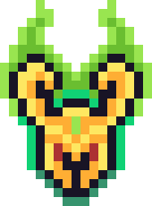

# Loki Engine

Simple 2D Game Engine made from scratch with C++, SDL and FMOD

# Roadmap

- [X] Textured Quad
- [ ] Inputs
  - [ ] Joystick
    - [X] Haptic Rumble (vibration)
    - [ ] Input control
  - [ ] Keyboard
  - [ ] Mouse
- [ ] Window Modes
  - [ ] Fullscreen
  - [ ] Resizing 
- [ ] Font Text Rendering
- [ ] FMOD
  - [X] Play Test Sound
- [ ] Tiled Map Reading
- [ ] Aseprite File Read
- [ ] Sprite Batching
- [ ] Sprite Animation

# Testing of the engine (Clones of Games)

- [ ] (WIP) Pong
- [ ] Flappy Bird
- [ ] Breakout
- [ ] Patience Card Game
- [ ] Super Mario World

# Original Games

- [ ] Monkey Butt Stomp
